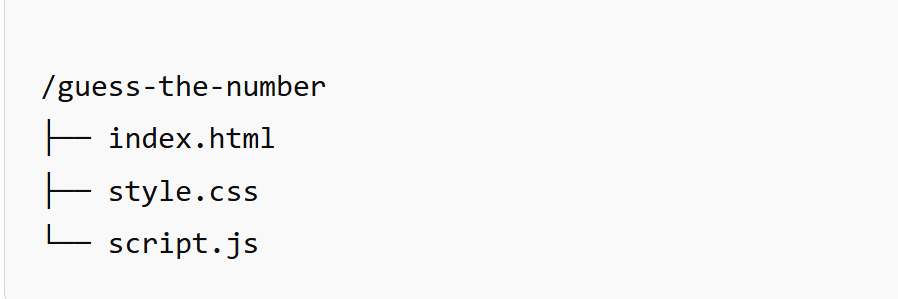
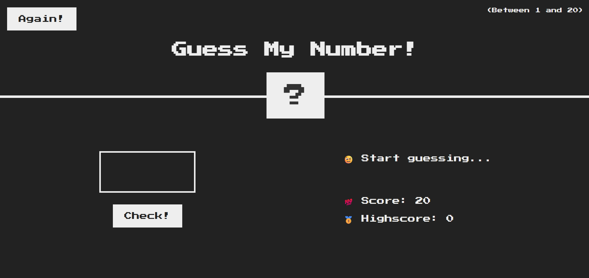

## 🔢 Guess-Number-Game

Guess the Number" is a fun and interactive number guessing game built using vanilla JavaScript, HTML, and CSS. The user tries to guess a randomly generated number between 1 and 20. The game provides feedback on each guess and tracks the highest score achieved during the session

### 🚀 Features
* ✅ Random number generation between 1 and 20
* ✅ Real-time feedback for too high or too low guesses
* ✅ Dynamic UI updates based on game state
* ✅ Highscore tracking within a session
* ✅ Game reset functionality
* ✅ Simple and responsive user interface

### 🧠 How It Works
* A random number is generated when the page loads or when the user clicks the "Again!" button
* The user enters a guess and clicks the "Check!" button
* Feedback is shown based on the guess:
    ☑️If no number is entered, a warning message is displayed
    ☑️If the guess is correct, the background turns green and the number is revealed
    ☑️If the guess is incorrect, feedback is given indicating whether the guess was too high or too low
    ☑️The user's score decreases by 1 with each incorrect guess
    ☑️If the score reaches 0, the user loses the game.
    ☑️The highest score is preserved during the session.

### 📂 Project Structure

### 📸 Image 

### 🛠️ Technologies Used
* HTML5
* CSS3
* JavaScript (ES6)

### 🔄  Reset Functionality
Clicking the "Again!" button will:

☑️ Reset the score to 20
☑️ Reset the UI to its initial state
☑️ Generate a new random number
☑️ Preserve the current high score

### 🧑‍💻 Author
###### Mohammad Baghban Rezaee
GitHub: https://github.com/mohammadr1997
